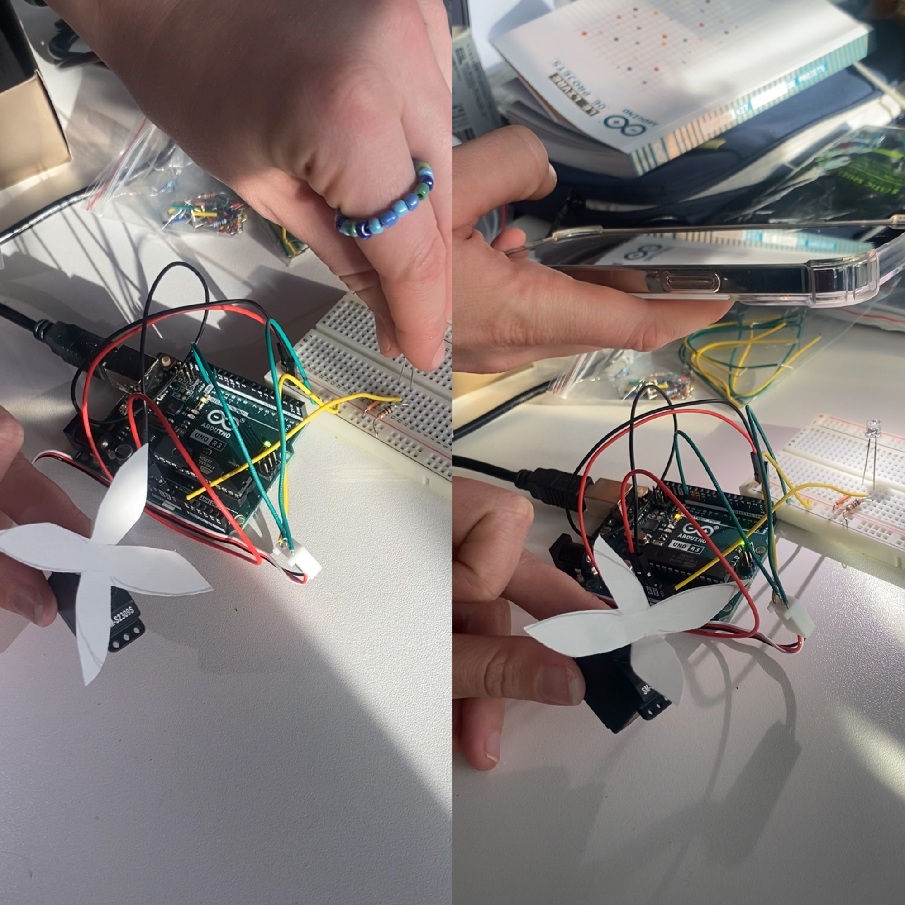

# Electronics 

Phototransistor associé à un Servomotor

Le phototransistor réagit à la squantité de lumière et va faire bouger le moteur ce qui fait tourner la fleur.

Intéréssant maybe for the soft robot pour permettre de faire bouger mes softs robots au mur avec des éléments statiques en bois qui en cognant le papier vont faire du son.

Le robot pourrait peut être utilisé le phototransistor pour s'ouvrir et se refermer en fonction de la quantité de lumière.

