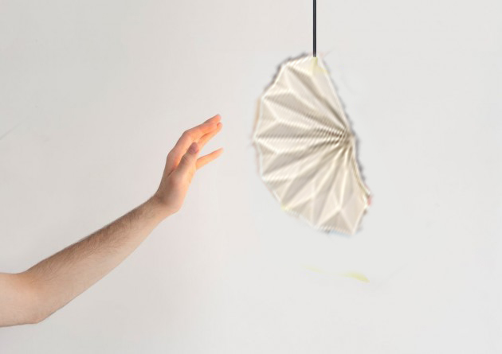
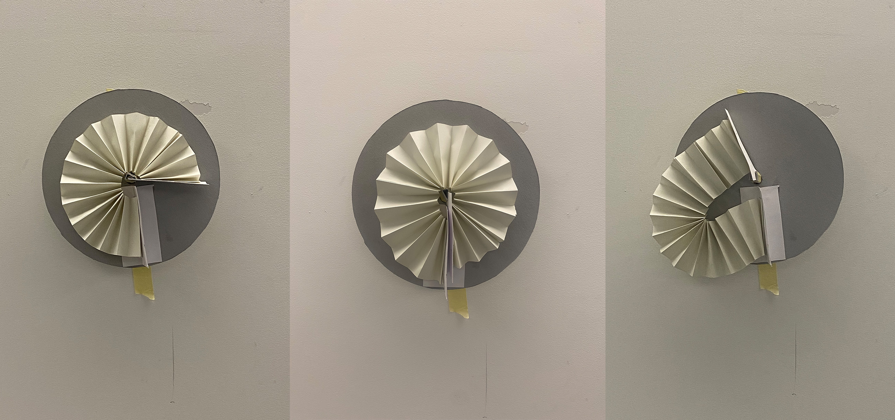

# Elisa Bernard

Soft Robots
Master Media Design + O2R

# An escape to elsewhere

# Research Question / area of research
- HOW - can i feel outside when i am inside ?
-  HOW - does the robot bring me elsewhere ? 
- How - could the soft robot help you visualize weather or brightness differently through movement & sound?

# Pitch
My soft robot mimic the function of the window as a portal, that connects the inside and the outside world, offering an escape to elsewhere throught movements and sounds. 

# Prototyping research
My research in soft robot prototyping explores the qualities of unfolding and opening through various folding techniques, emphasizing scale and how an opening can transport us to elsewhere, like a portal. I experiment with structures that start small and expand to become much larger, offering a possible escape. The folding movements are studied to enable different qualities of opening, while also integrating a sound dimension: the crumpling and rustling of paper evoke the rustle of leaves or the flapping of wings, connecting the interior to the exterior.

- Unfolding and folding ideas threw precise or unprecise movements.

  
 
 
 
 
 
 
 
 
 
  
 

  
   
   
  
    
# Your key prototype
The prototype is a wall-mounted soft robot that transports you elsewhere by mimicking the portal aspect of a window. It folds and unfolds, reacting to the brightness of the outside world, connecting the inside and outside. As it unfolds, it produces paper crumpling and rustling sounds, reminiscent of leaves in the wind or bird wings flapping, offering a soothing escape and moments of tranquility in everyday life.

# First key prototype

# Second key prototype
 
   

# User scenario

# Next Steps
I will choose one of the two prototype. Resolve are the open mechanisms can work while thinking of the electronic part. I will also focused on the sound aspect of my soft robot.