# Elisa Bernard
- Soft Robots
- Master Media Design + O2R

## Area of intervention

The window as a medium (portal) that intertwines the outside and inside worlds and affects behavioral responses.

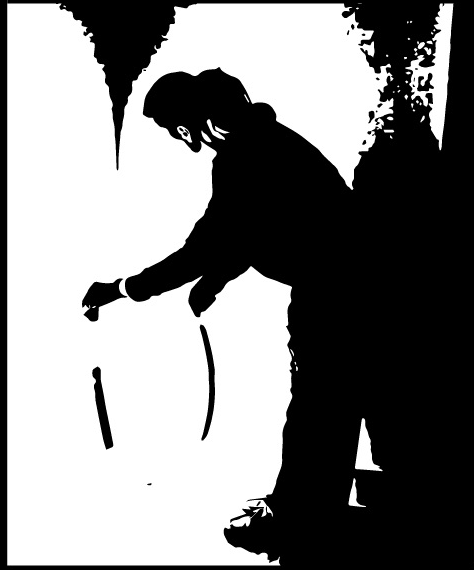

## Research Question

- **How can I feel like I am outside when i am inside ?**

## Research

My research centers on the window as a dynamic portal that affects my habits, behaviors, and emotions by modulating light and connecting inside and outside worlds. In observing my large bay window, I’ve documented how it influences my positioning, mood, and daily routines, revealing a subtle interplay between light, space, and personal responses.

# 1 - Window's actions listed 
> all that the window do for me and i take for granted.

 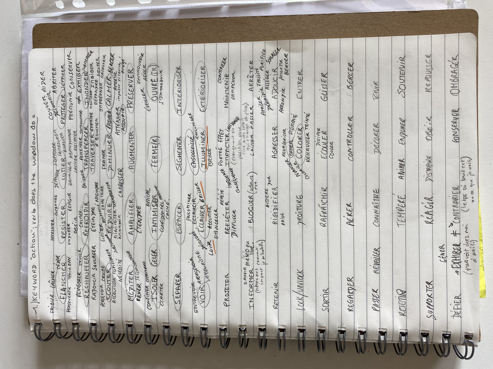

 # 2 - Timelaps of light on the space 
 
  > change the space of the room + dictates my positionning in the room.
 
  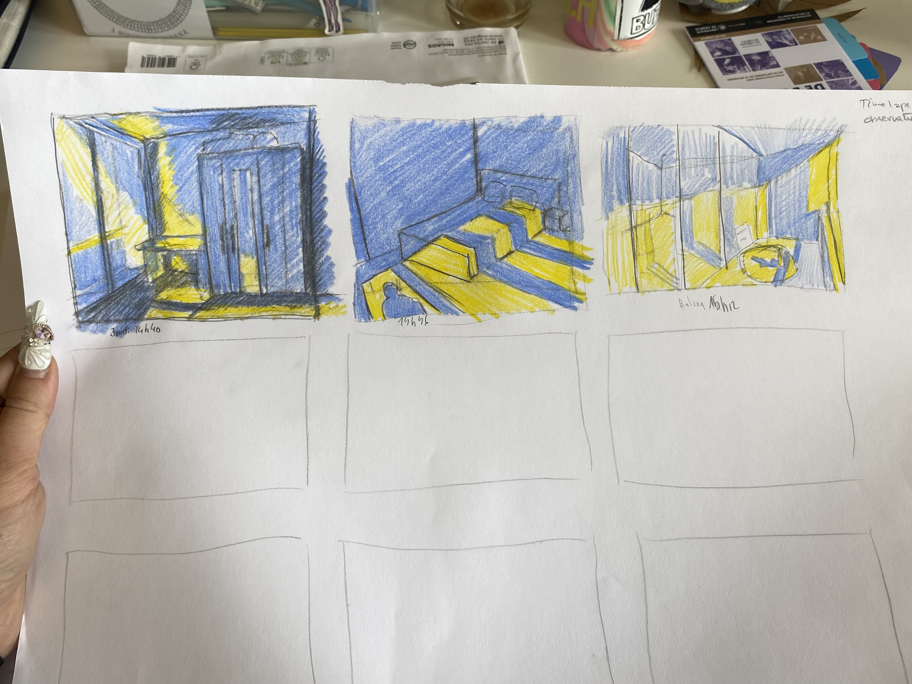

  

  # 3 - Cards - keyword - action-behaviour that follows.
  
   
   
   
   
   
  

   - Little Image of my mind right now

   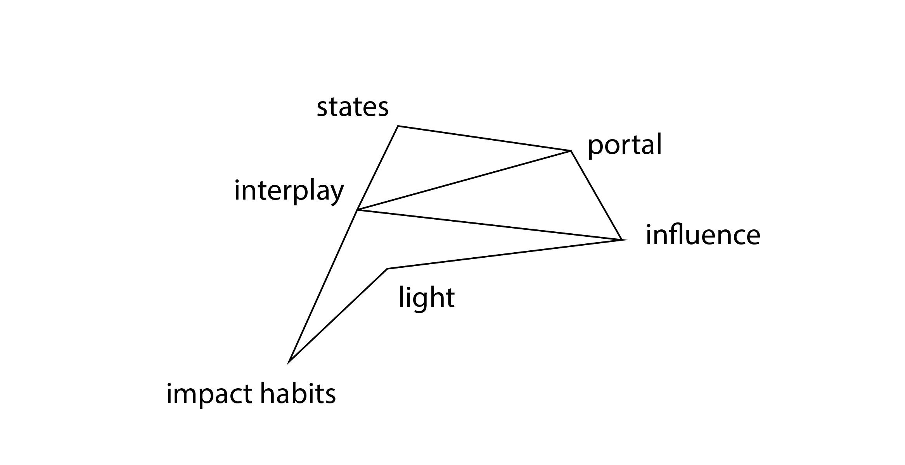

   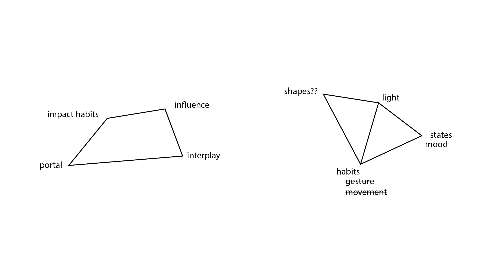

   # 25th question on the scenario for the soft robots

1. **Who** interacts with the robot ? 
2. **How** do these subjects interact ?
3. **Why** for what reasons is interaction taking place?
4. **Where** under what conditions is interaction taking place?
5. **WHERE** - Where does exist?
6. **WHO** - For who is it?
7. **WHAT** - What is it? What does it do?
8. **HOW** - How does it behave? 
9. **How** do people get the information they need? 
10. **How** do they interact with it? 
11. **How** does it communicate?
9. **WHY** - Why does it exist?
10. **What** does it feel like doing ? 
11. Is it a helpful or not helpful robot ? 
12. How does it influence me ?
13. Do we entertain an relationship ? 
14. what kind of relationship ? 
14. Do I like this robot ? 
15. Do I dislike it?
16. Can I play with it ? 
17. Can i communicate with it ? 
18. How do we comprehend ourselves ? 
19. What sort of language we use to communicate ? 
20. Do we talk to each other ? Is there other way of comprehend ourselves? 
21. Threw gesture? the robot detect the movement with a camera he recognize when we wave to him, blink ects. He's able to reconize those different physical pose ? 
22. Can he recognize emotions ? States ? 
22. Does he have emotion ? How can he convey them to me ? Threw googly eyes ? Position he takes ? glowing light ? 
23. Can he suiscide itself ?
24. How can he convey or show different states by moving ? Take certain position ? 
25. How does he move ?  Does he slip, ramp, crawl, roll, jump, fly, pull, stretch, shrink, expand, blow itself, on wheels ? 

   # Windows Around the World – How Are They Different and Why?

   Shoji windows introduce a unique philosophy on the connection between inside and outside spaces, fostering a meditative, mindful experience. They frame selective parts of nature like living paintings, encouraging daydreaming and meditation and the occupants to slow down.

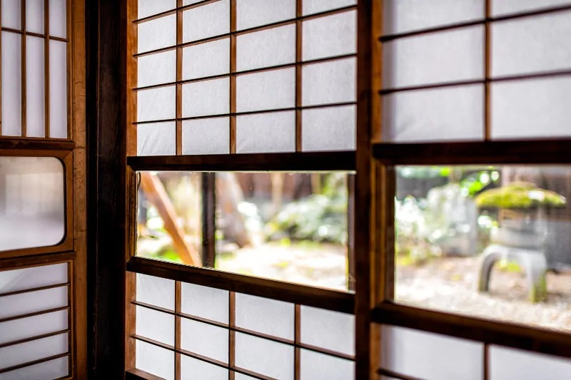

> Yukimi shoji « fenêtre pour contempler la neige ».

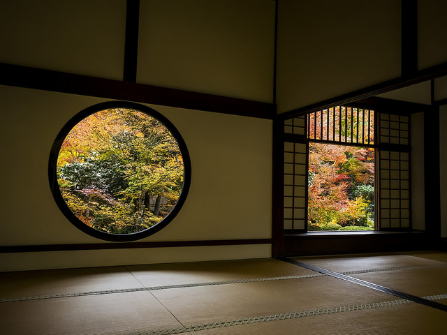

## Insights

- Behavioral Influence: The window subtly dictates your actions, positioning, and routines.

- Emotional Connection: Light intensity and weather conditions seen through the window impact your states.

- Portal Concept: Acting as a portal, the window connects your space to the outside.

## First ideas & prototypes

Last week, my landlord offered me the option to switch to a larger room with a roommate. However, when I saw her room, I realized it was poorly lit due to a small window, and I quickly chose to stay in my own. This made me reflect on how crucial natural light and outdoor connection are for my well-being. It got me thinking — **could a soft robot help recreate the sense of space and connection that a window provides in a dim, isolated room?**

- **How can I feel like I am outside when i am inside ?**

### Breezora 

Breezora is an illuminated soft robots that draws inspiration from the natural rhythms observed through my window in Annemasse. It's purpose is to give the sensation of having a living environnement especially for those suffering from poor quality windows. 
We can connect ourselves threw breathing techniques, leading like Shoji's (japanese windows) features to encourage **mindfulness** and **contemplation**, **inviting occupants to slow down**.

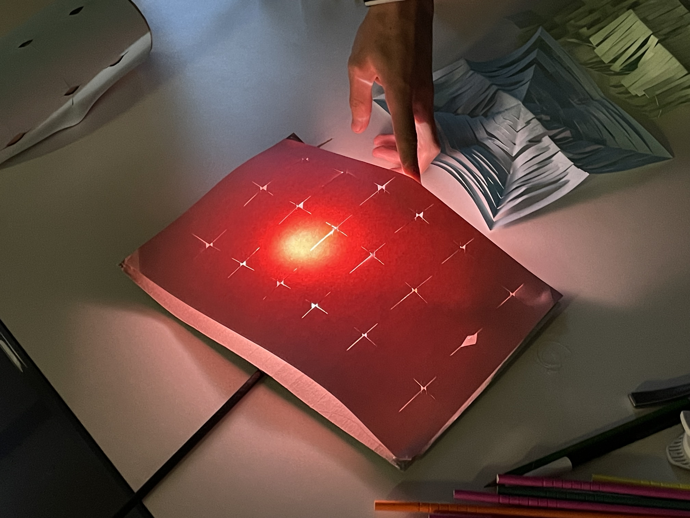

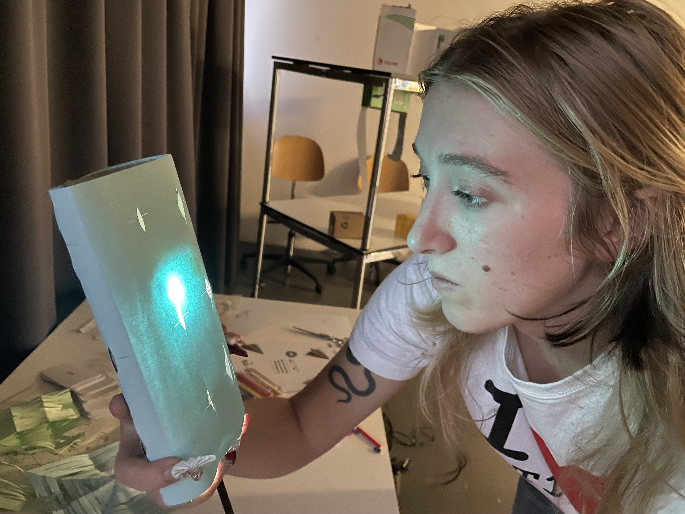

# WindoBot / Solace

Solace embodies my personal interpretation of the window as a tool that enables communication with our environment, and consequently, reflection with ourselves.

WindoBot is composed of adjustable components, each reflecting a crucial element of the window. Through their interactive nature, they endeavor to evoke the sensation of opening a window, creating an experience of the outside in an indoor place. To achieve a realistic reflection of our precise external environment, the implementation of real-time weather data could be implamented ? 

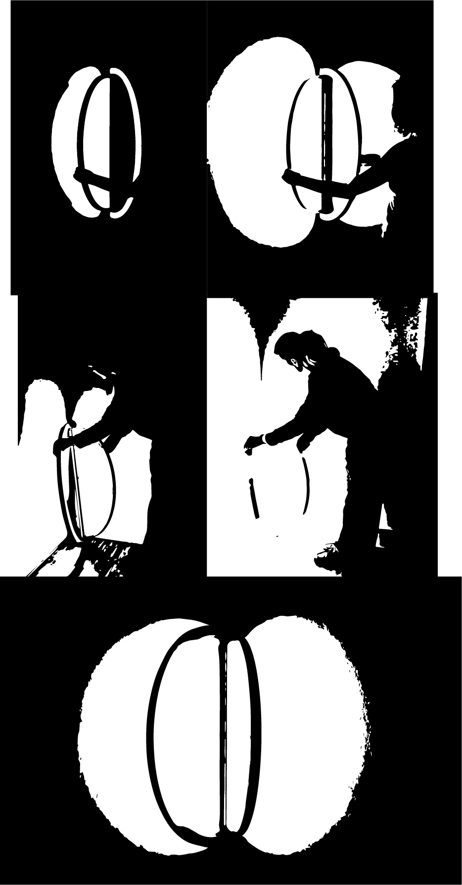

The interactivity lends itself to the sensation of opening a window, while gaining differet light features. 

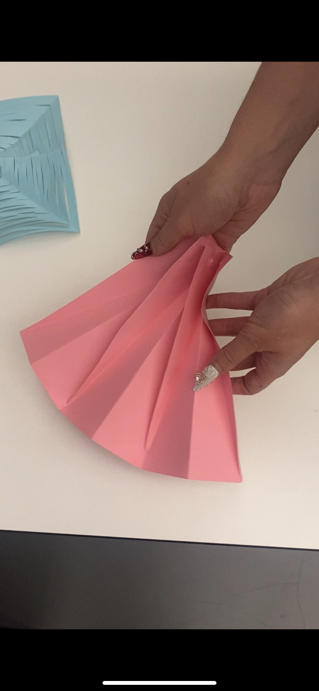

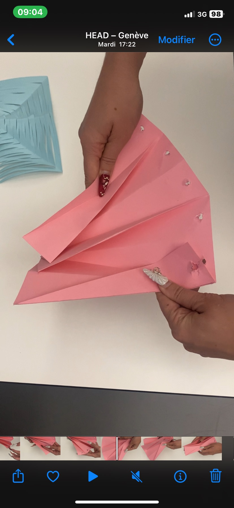

## Next Steps

I'll focused on the third prototype "Solace" and try to found different techniques of folding and unfolding with papers prototypes. I'll go in do some research in what is done in Oribotics = Origami + robotic + biomimetism
&
Orimetric = Origami + modern molding fabrication techniques
