# Form follow function 

# Feedbacks 

Sound work / explore it 
The light can be explore maybe later = LESS IS MORE.
Echoing effect of paper (with wood box) Natural resonance like a speaker but different.
Much better than adding a speaker.
Hypnotic visual = you get lost just by looking at it.
Peut être utiliser un moteur qui réagit à la chaleur - moins de bruit qu'un servomoteur. 
Dynamic already in the shape référence : William Darrel. 

Think about the scale / Larger ones and keep some small ones to.
Inside Outside is the thing. You can get back to it later

Inspiration in old meteorological machines for the movement.

Water works well = change with pressure = Baromètre. 
Energy to motorized your robot = Play with the heat of the room. Sun.  mitro controlleur heat. Phycical ambiant room phillip ram (architect) = see is conference, spaces hot air going up and down in a room.

Quelque chose de presque siprituelle dans mon robot 
Entre le baromètre et le dieu du soleil.
Dream machine lampe - image fractale
Ajd lanternes magique qui te font rentrer dans des états de conscience. 
Réf = Roxyva. 

# Feedback générale

- External and interior sensibility 
Play with the input inner sensiorality ex: Thermical / état de conscience. 

- One more object in our daily lives - good balance between input output / ressources / solution / environnement / emotionnal impact.

- You can have many intercation with only one robot 
You can do more / better with less.

- Interacting with materials of are everyday lives 
Pre-existing "water, air, atmosphere" = maybe provides more intelligence to your object.

Why Soft robot are interesting ? 
Hard to control elephant trunk but gives many opportuynities.
Don't close the intercation = open it. 
Playing maybe with more aléatoire. 
Experiment with people. 
Maybe in the futur your soft robots learns = machine learning.

# Development of the project :
- Prototyping different scale of flowers

- First ideas for the shape of the soft robot 

      I was trying to think how I could move the wooden wand for it to fold and unfold the flower. 
      At first i was thinking of a mechanims where there could be some rails with only the baguette moving but i sort of let out that idea because rails are super expensive to make. 

# Shape research 
    Drawing inspiration from le "Soleil Levant", & old weather tools. I tought in a second phase that there could be arcs that symbolise the course of the sun with only a baguette that will moves verticaly to close and unclose the flower. 

Here are some drawings where you can see somùe research ideas on the mechanisms to be ale to have some interesting movements. I was thinking of using maybe an "actionneur linéaire" which is used in object like an Axidraw. 
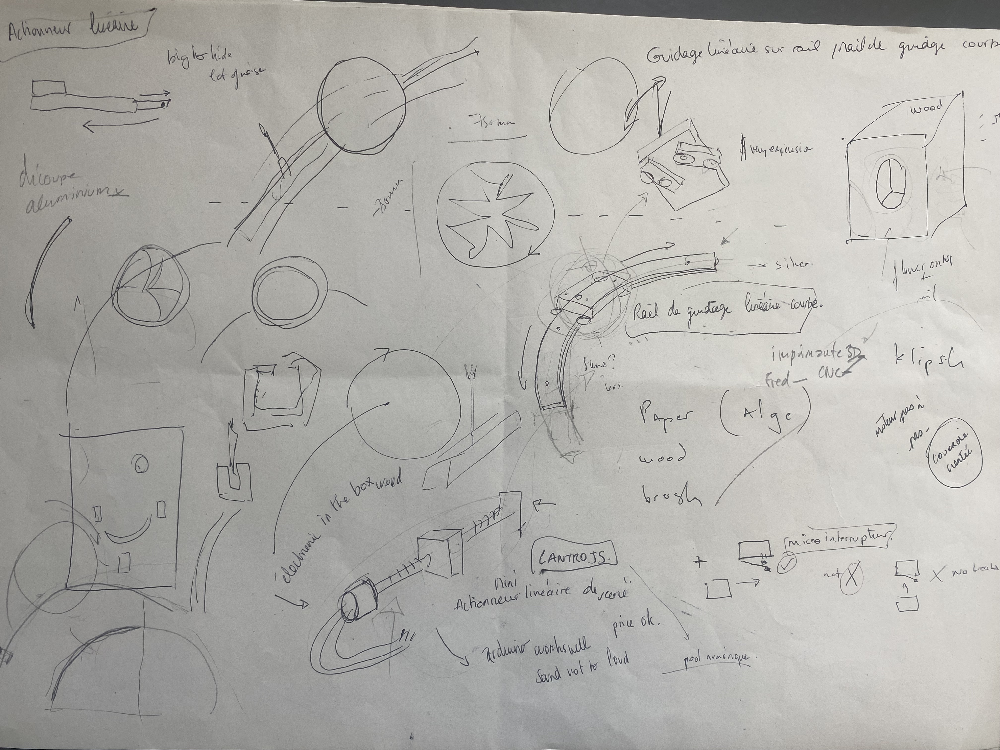

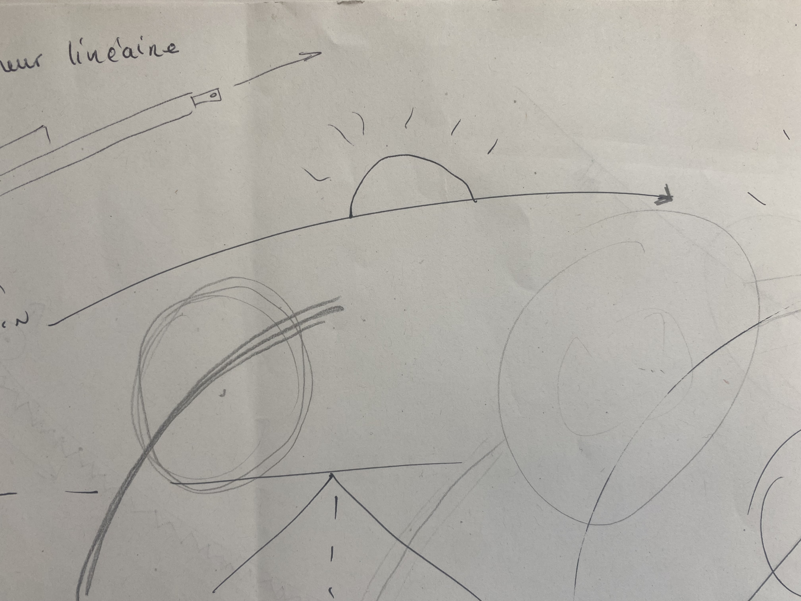

Some shape resarch on what the robot could look like with this arc and what feeling we will get from it. This even whithout knowing it was the starting idea to have finally the arc moving and not just the wooden wand. 

So i prototype this in paper first to have an idea of the proportion that could have the different elements. 

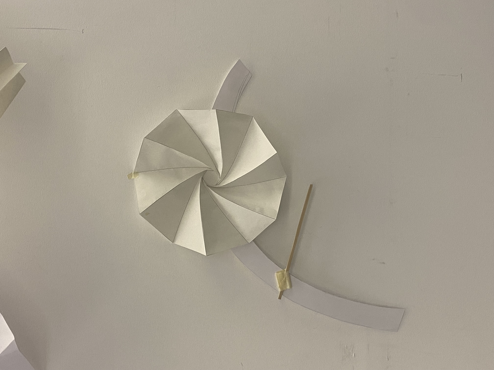
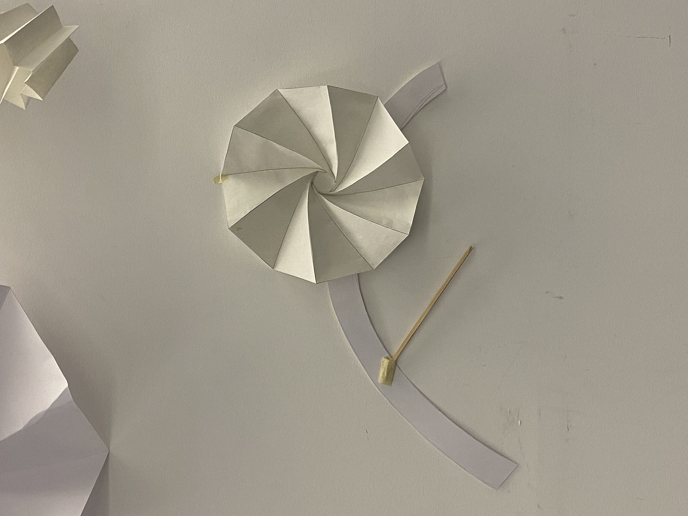
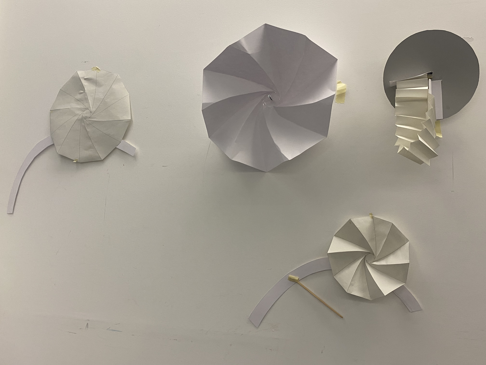

I made those first arcs in wood with the laser cut. 
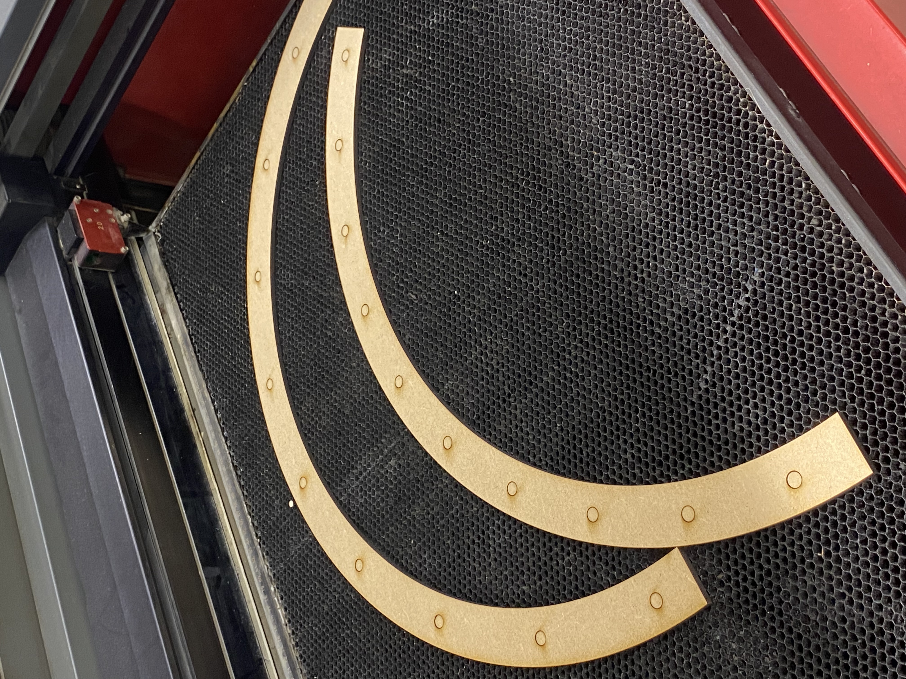

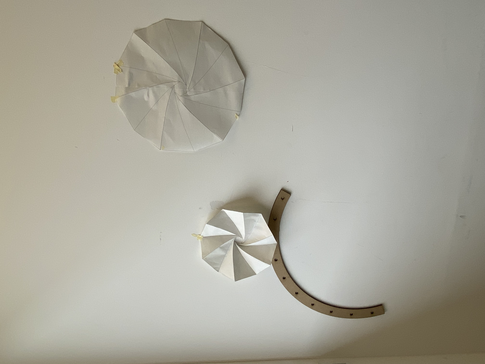

Here i was looking at the soft robot which had this arc who didn't move and just the wooden wand. 
For me it loose some dismensions top the project/ and the wooden wand that didn't travel anymorer around the flower won't be able to close it if it moved only vertically. 

So i asked myself the question :
Could the arc be the one that moves ? 

# Could the arc be the one that moves ? With the wooden wand on  it. 

I started thinkin how i could possibly do this. And finally the idea of a rail that would be notched came into my mind. With a gear mechanisms.

I had to do several calculations to be sure that the gear works. I had to also had to come with 2 guide wheel to ensure that the arc will be able to move and not fall during his course. 
I chosen to fix all those 3 elements  on a same piece of wood to secure everything of moving while the stepper motor put the rail into motion. 

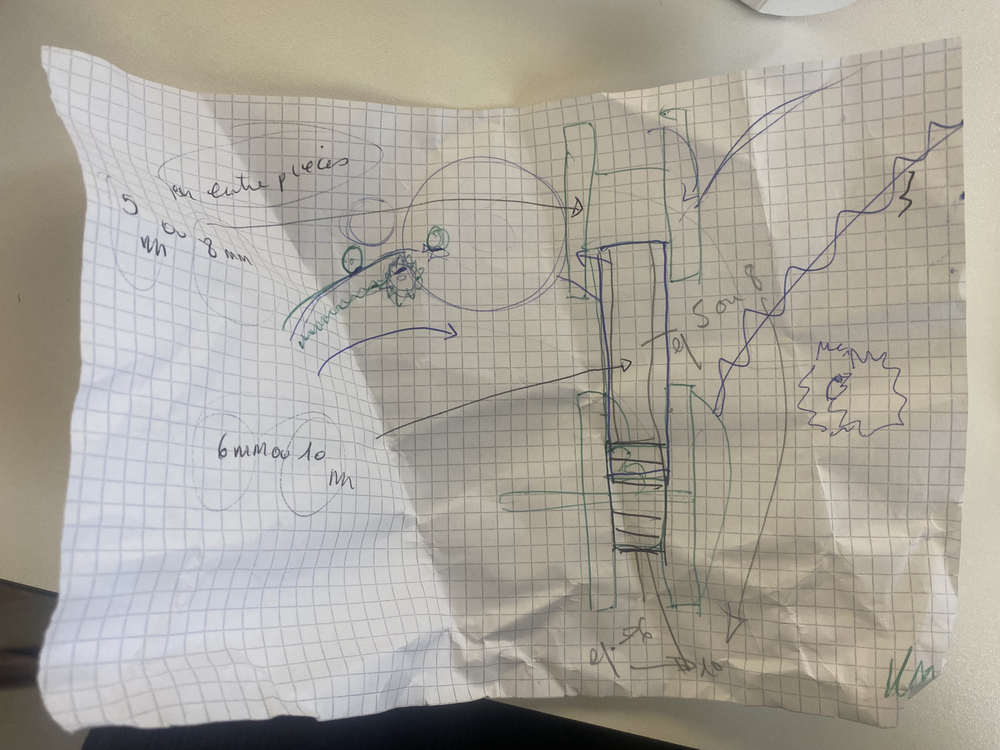

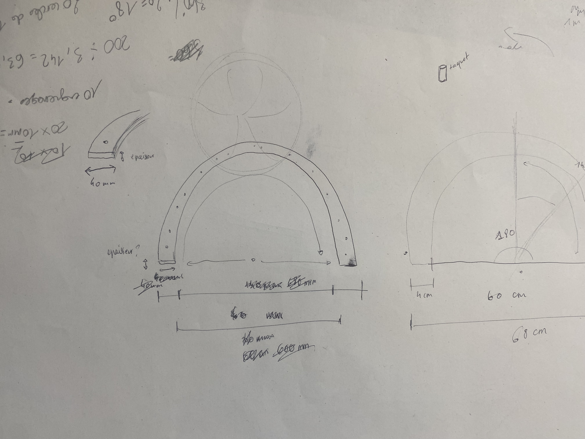

After several interviews at the wood studio i finally cutted my wood with the laser cut. Every millimeters was important for the mechanisms to be bale to move and not get stuck with friction. 

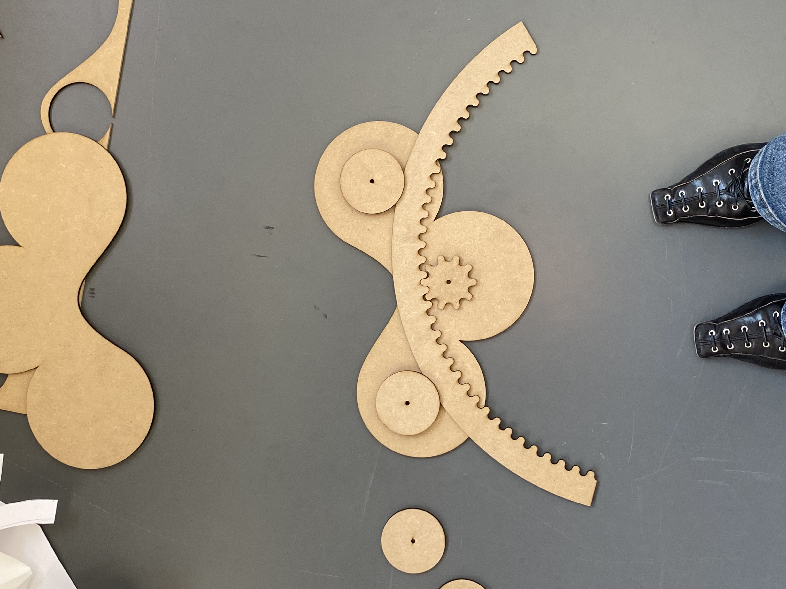

 

 

 It worked !! I was so happy. But with my hand. It was an other challenge to make it functionnabl with the stepper motor. 

# Operating the mechanism

 
  
   
    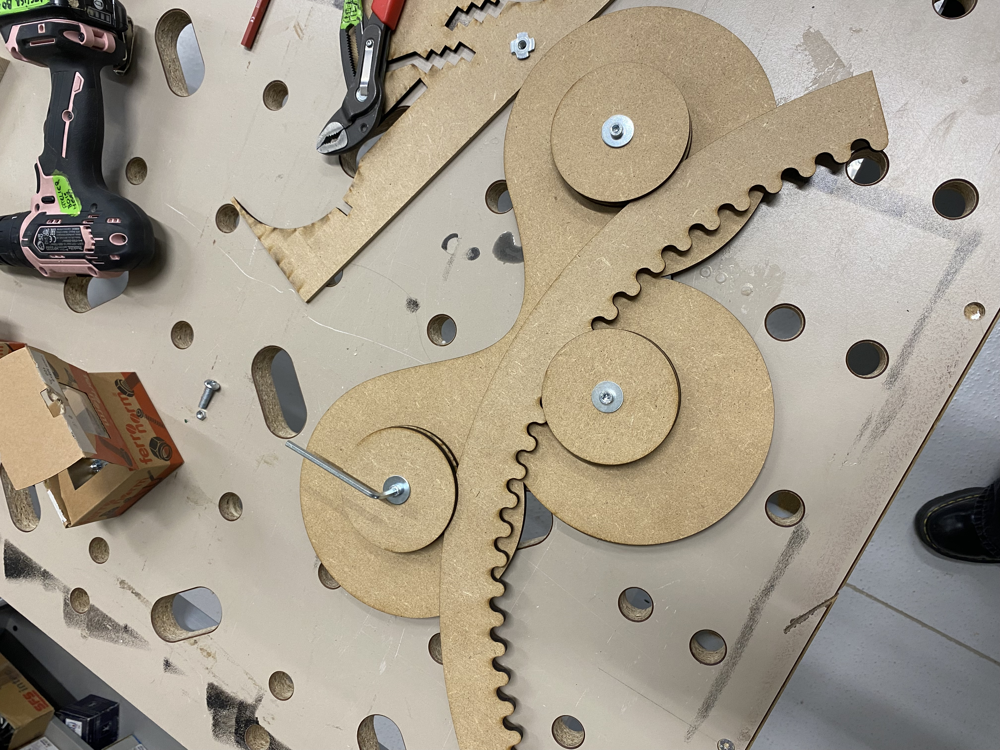
    

  

  

  # Weeks in the wooden & metal workshops. 
We had to do a unique cuztomise piece in silver for the stepper motor to be able to rotate all the elements together. 
   

Printing my box in 3D printing to hide the electronics of the flower. 
   
   
 

Using a small stepper motor to make the flower rotate and control her speed. 

  

  Going back to the wood workshop 

# Exposing the prototype and finalisation of the shape 

Adding the wooden wand on the arc. And creating a fake wall for presentation. 

Electronics 

# Jury presentation : 

