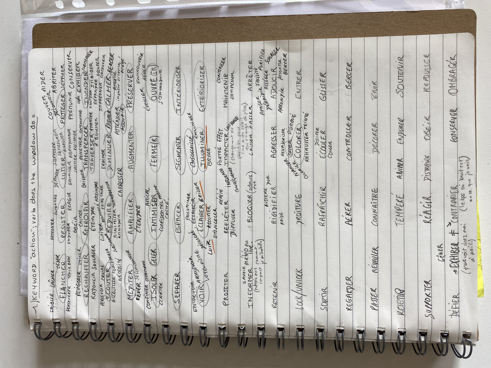
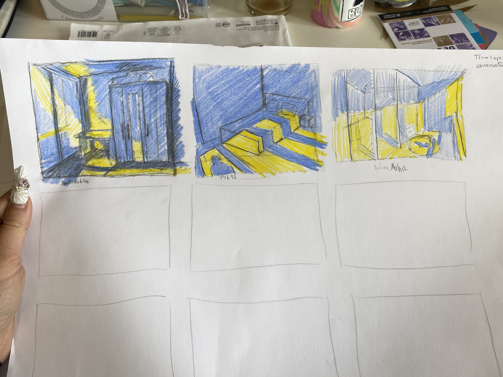
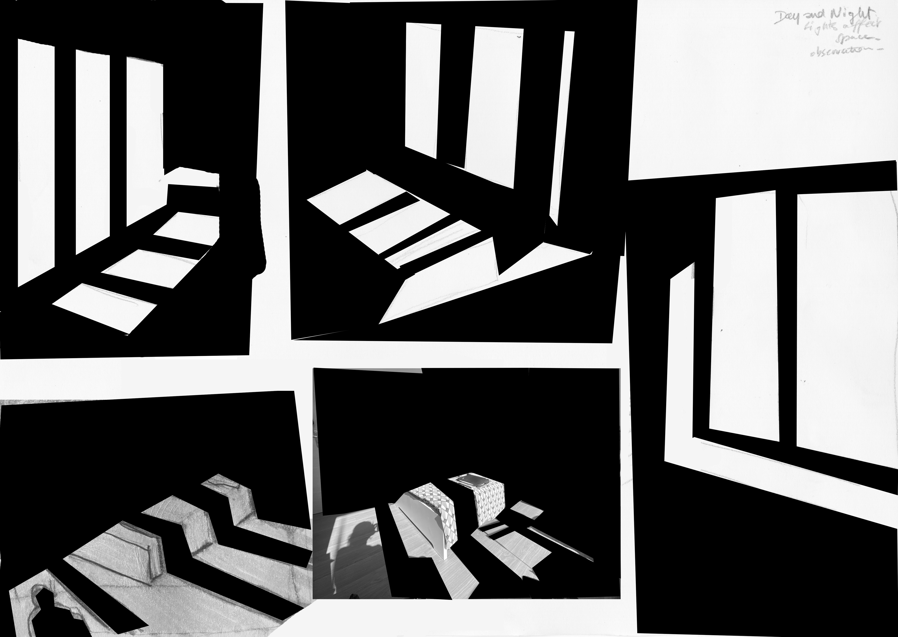

# First week 

This section contains all the research and observations made during the first week. It was a time of gathering information and reflecting on how certain elements in the domestic area influence the environment. 

I began by paying close attention to my window the interactions between light, space, and the human experience within these spaces. Throughout the week, I took note of how light impacts the atmosphere in different areas of my room, with windows serving as my medium for this interaction. 

- *Notes to myself*

*These initial observations will be fundamental in shaping the direction of the project, setting the stage for deeper exploration for the soft robot.*

# My Zone of Interest : my window.

The primary zone of interest I've chosen to focus on is the **large bay window** in my bedroom. This window plays a key role in connecting my interior space with the exterior world, acting as both a **boundary** and a **portal**.

# Why ? - take a simple window for my zone of interest ?

This particular window has a **profound impact** of how I experience my room. Not only on the physical layout and lighting of my room, but also on my own behavior and mental state. 

> I wrote a little poem unfinished on my window : 

" La fenêtre si transparente soit-elle ne passe pas inparçue. Digne, elle se tiens droite en toute saison. Contre pluie, vent, grêles elles ne **flenche**. Et quand Neptune est furieux elle encre ses grands pieds dans notre parquet, tiens de ses deux mains les murs qui l'encadrent et **résiste** au plus méchant des vents. S'enssuie une **lutte** invisible qui parfois dure jusqu'au petit matin. Pendant que nous , habitué à sa nature **protectrice**, nous nous blotissons dans nos draps. Il y fait bon et ne fait pas froid. 
Ses efforts sont enfin récompensés quand après le plus grand déluge un rayon la **transperçe** de son dôré. Il l'a réchauffe, la fait sourire, ce qui **inonde** la chambre de reflets. Elles nous **offre** chaque jour un bouquet colorés..."

> What is intersting here, the verbs use to describe the actions the window do fo us.

# To do liste biche <3

- Investigating the actions the window performs for me. Write the keywords.

- Studying the light at different times : drawing how the window interacts with light at different times of the day. I will analyze how it diffuses light, segments shadows, and affects the overall atmosphere of the space.

- Drawing its different "states" and defining habits related to it: I plan to create sketches that capture the window in various conditions—and how these states correspond to different behaviors or feelings. 

> Through this process, I aim to develop a deeper understanding of how the window’s changing states influence my interactions with it and the room as a whole.

# Context Exploration : 

# 1 - Window's actions listed 
> all that the window do for me and i take for granted.

 
 
 # 2 - Timelaps of light on the space 

 > change the space of the room + dictates my positionning in the room.

 
 

 # 3 - Cards - keyword - action-behaviour that follows.

 
 
 
 
 
 

 # Conclusion of the first week : 

1. > The window plays a pivotal role in **shaping my habits.** and **how I engage with the space.**

Its actions go beyond just providing a view or allowing light and air in my bedroom. It subtly ***dictates my gestures*** and routines. When the sun becomes too strong, I instinctively shield my eyes or reposition myself in the room. On sunny days, I find myself lying on the bed to rest in the warmth, while in the mornings, the light helps wake me up, prompting me to open the window to air out the room. When the room heats up from sunlight, I’ll undress or adjust layers if it feels colder. I move through the space, positioning myself according to where the light falls, whether it's to read in natural light or to avoid glare while working on my computer.

***Simple actions, like hiding from the sun when it’s too bright or positioning myself to rest in a sunbeam, shows how the window’s interaction with the environment dictate strongly my habits.***

2. > The window connects the inside with the outside world, like a **portal** 

The weather through the window informs me how to dress as well as it influence my mindset when stepping outside.
It also influences whether I feel drawn to go outside or remain inside, depending on the conditions it reveals.

*notes to myself : digg into the notion  of portal*

3. > The window also influence **my state.**

The shifting light, whether soft, harsh, or diffuse, alters the energy of the room and my own sense of well-being.
When the light is soft and diffused, I feel a sense of relaxation and comfort. Aggressive light, on the other hand, makes me seek out darker corners to retreat.
Rainy days seen through the window make the room feel like a safe, cozy space where I can relax. The light not only shapes the room’s energy but also affects my mood and overall mindset throughout the day.

# To conclude

> In essence, the window is a **dynamic element**, a **portal** that affects my gestures, **impact my habits**, **influence** my feelings, and how I interact with the space around me, creating a constant **interplay** between **light, states, and habits.**

