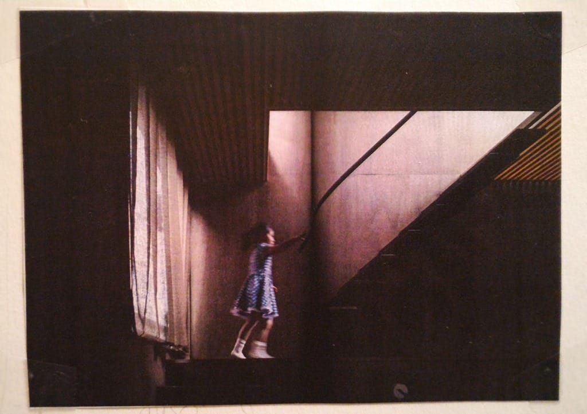

# Second Week
# Further observations around the window.

Summary of last week's observations

> In essence, the window is a **dynamic element**, a **portal** that affects my gestures, **impact my habits**, **influence** my feelings, and how I interact with the space around me, creating a constant **interplay** between **light, states, and habits.**

- Little Image of my mind right now

# Questionning ? My brain is hitting i high peak of hotness right now. S.o.S 

- should a forget the "light" for a while ? idea of the robot reacting to light or doing light polluting my mind.
- i want to do some research on speculative design. Should my robot really be usefull ? 
- robots always need to serve a purpose ? Can't it be lazy ? Useless ? 
- if it does work with light, how can i stop mendling the light with this health approach or simple and general things like colors + emotions = enlights the room. Boring. How can  light be an input or output different from this ? 
- maybe search in nature and animals what light do ? what interactions, interplay happens, at different scale ? different habitats, environnements ? 
- got a referencde that cross my mind une nouvelle écrite par Italo Calvino.
- alexia give me the referenced "L'étranger" D'qalbert Camus qui finit par se brûler avec le soleil. (son ambition jsp ? si c'est figuratif or symbolique) ? 

- heard "toxic positivity"

# (Exercices d'Observations Nicolas Nova 2 Série de Questions) 25th question on the scenario for the soft robots.

1. **Who** interacts with the robot ? 
2. **How** do these subjects interact ?
3. **Why** for what reasons is interaction taking place?
4. **Where** under what conditions is interaction taking place?
5. **WHERE** - Where does exist?
6. **WHO** - For who is it?
7. **WHAT** - What is it? What does it do?
8. **HOW** - How does it behave? 
9. **How** do people get the information they need? 
10. **How** do they interact with it? 
11. **How** does it communicate?
9. **WHY** - Why does it exist?
10. **What** does it feel like doing ? 
11. Is it a helpful or not helpful robot ? 
12. How does it influence me ?
13. Do we entertain an relationship ? 
14. what kind of relationship ? 
14. Do I like this robot ? 
15. Do I dislike it?
16. Can I play with it ? 
17. Can i communicate with it ? 
18. How do we comprehend ourselves ? 
19. What sort of language we use to communicate ? 
20. Do we talk to each other ? Is there other way of comprehend ourselves ? 
21. Threw gesture ? the robot detect the movement with a camera he recognize when we wave to him, blink ects. He's able to reconize those different physical pose ? 
22. Can he recognize emotions ? States ? 
22. Does he have emotion ? How can he convey them to me ? Threw googly eyes ? Position he takes ? glowing light ? 
23. Can he suiscide itself ?
24. How can he convey or show different states by moving ? Take certain position ? 
25. How does he move ?  Does he slip, ramp, crawl, roll, jump, fly, pull, stretch, shrink, expand, blow itself, on wheels ? 

# Exercice 3

# Les fenêtres dans le monde – en quoi sont-elles différentes et pourquoi ?

# Japan 

Les Japonais soulignent que le « shôji » n’est pas uniquement un élément de construction qui éclaire l’intérieur ou retient la chaleur. Il est considéré comme un élément culturel ayant un impact significatif sur les occupants de la maison. Comment est-ce possible ? Grâce à sa conception spécifique, sa « lumière » peut être rapidement et facilement recouverte de papier, de manière complète ou sélective, laissant un espace libre à un endroit précis.

Le champ de vision est limité à un espace spécifique. La vue depuis une telle fenêtre japonaise est comme un tableau vivant qui vous permet de profiter de la nature et enrichit l’architecture intérieure. Il existe plusieurs types de « shoji » : yokogarasu shoji avec une vitre horizontale placée à mi-hauteur de la fenêtre, gakubuchi shoji avec un carré ou un rectangle pour admirer le monde extérieur au milieu de la fenêtre ou koshidaka shoji avec une vue inférieure à la moitié de la hauteur du panneau entier de la fenêtre. 

Offrir un morceau de paysage choisi à travers une fenêtre est une façon unique de profiter de la nature. Le panorama visible par la fenêtre est comparable à une véritable image et fait partie intégrante de l’architecture toute entière.

> Yukimi shoji « fenêtre pour contempler la neige ».

Une curiosité avec la yukimi shōji, ou « fenêtre pour regarder la neige tomber », dans laquelle une partie du rectangle oblong est composée de verre. L’idée est de masquer le ciel et les éléments superflus pour focaliser la vue uniquement sur le sol enneigé. C’est une astuce pour que les personnes concentrent leur regard sur la neige qui tombe et qui, lentement, recouvre le sol.

> Kazari shoji (fenêtre décorative)

Kazari Shoji (Decorated window) is an art itself. Light filtered through the window from outside emphasizes the beautiful designs.

These separated windows divide the view into four different scenes. Each window cuts out a different part of the same scene, but the impression of each is completely different when set apart like this.

> The window of spiritual enlightenment and the window of bewilderment, Genkou-an, Kyoto

The circle window on the left is named "the window of spiritual enlightenment". In Zen Buddhism, the circle represents an innocent figure without any prejudices. This window expresses the final stage of spiritual enlightenment.
In contrast, the rectangular window is named "the window of bewilderment".
That rectangle shape expresses a humans' life. The four corners of the rectangle express four pains people cannot avoid in their lives: to be born, to get old, to get sick and to die.

# L'ARCHIPEL DE LA MAISON : 
# Feng shui
Le feng shui est un art millénaire d'origine chinoise qui a pour but d'harmoniser l'énergie environnementale d'un lieu de manière à favoriser le bien-être, la santé et la prospérité de ses occupants.

> Exposition : “Japon, L’Archipel de la maison” (l'essence des maisons japonaises)

 Plus qu’un art de vivre, c’est une manière de penser l’espace et de concevoir la maison. Ce recueil, particulièrement intéressant, porte un regard et un questionnement sur l’HABITANT et non seulement sur l’ARCHITECTE. 

 # La culture de l’éphémère

La première raison de cette longueur d’avance qu’ont les Japonais quant à leur perception de l’habitat, est sans aucun doute liée à un contexte géographique et physique, qui interagit mutuellement avec les contextes historiques et économico-social :

# Des maisons dessinées depuis l’intérieur

En Occident, on fait souvent l’éloge des grands architectes dont on ne connait que l’aspect extérieur des constructions. Et l’agencement intérieur des maisons se décide généralement après avoir validé un projet extérieur.

Au Japon, un architecte est avant tout un architecte d’intérieur. Ainsi, la forme et l’aspect extérieur de la maison découleront du confort intérieur !

# Emprunter le paysage
 

Par exemple, on utilisera le procédé de “shakeï” (“emprunt de paysage”, utilisé dans les jardins japonais) pour placer une fenêtre qui, depuis l’intérieur, cadrera un rocher, un arbre, une vue mer … tout en s‘évitant la vue sur un bâtiment peu esthétique. L’aspect extérieur des ouvertures (alignement, dimensions identiques) importe moins : l’essentiel est ce qu’elles cadrent depuis l’intérieur.

J’aime beaucoup cette notion “d’emprunter” et non de “s’attribuer” que l’on peut connaitre parfois dans des bagarres occidentales pour obtenir une vue mer ou une plage privée. 

En revanche, en l’absence totale de vue intéressante, les maisons se replieront parfois totalement sur elles-mêmes, quitte à en devenir des maisons “introverties”. Le jardin et les ouvertures donnant sur ce dernier, seront alors placées au coeur de la maison !

# Le rapport à la lumière

La frontière entre le “dedans” et le “dehors” étant bien marquée, la lumière, dans la maison traditionnelle japonaise, fait partie du “dehors”, la “maison-refuge” 

# Maison modernes Japonaises :

Nous avons vus des fenêtres de maison japonaises anciennes maintenant regardons quelques maisons modernes en se concernant sur les fenêtres. 

# Conclusion 

In contrast to traditional European windows, Japanese shoji windows cultivate a **unique connection between home interiors and the external world**, going beyond functional roles like providing light or insulation. Shoji windows hold deep cultural significance for Japanese households, shaping how residents perceive and interact with their environment. Unlike European windows, which typically allow broad views, shoji windows are designed with **selective framing in mind**. By offering glimpses of nature in carefully chosen segments, they transform the view into a **living artwork**, heightening one's appreciation of the surroundings.

This arrangement **encourages a mindful, contemplative way of seeing**. Different shoji styles like the yokogarasu, gakubuchi, and koshidaka create distinct visual experiences, each framing the landscape as if it were an integral part of the home's architecture. The precise way shoji windows frame these “living paintings” fosters an atmosphere of tranquility, **encouraging daydreaming and meditation**.

As a result, shoji windows inspire a different spatial awareness and behavior compared to European windows. They **invite occupants to slow down and appreciate nature’s subtleties**, viewing their surroundings with intentionality and restraint. This deliberate interaction with light and landscape reflects a broader Japanese cultural attitude: one that values balance, **simplicity, and a respectful coexistence between inside and outside worlds.**

