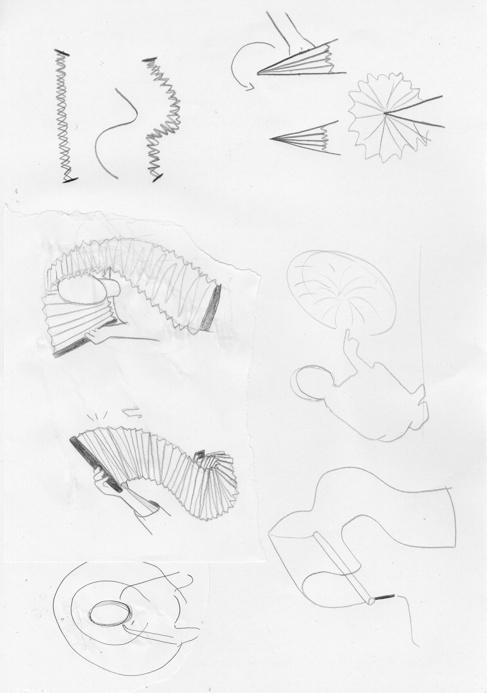
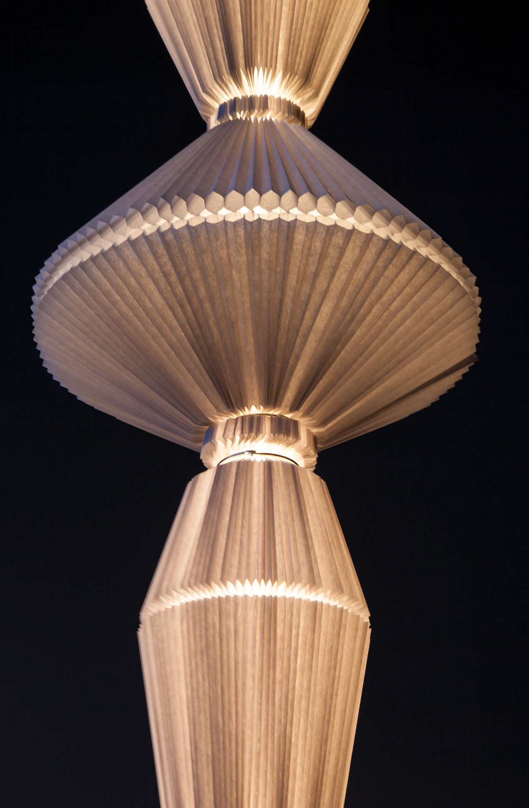
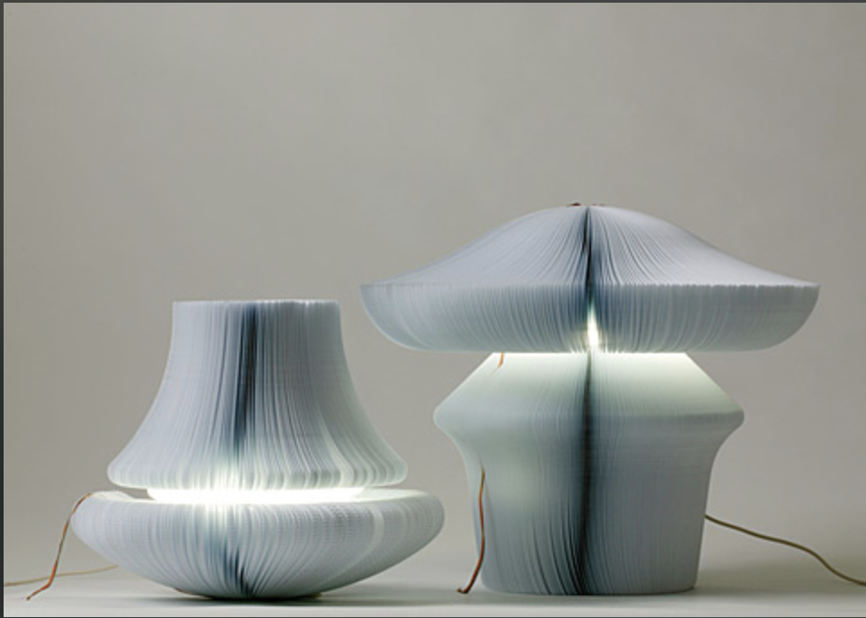
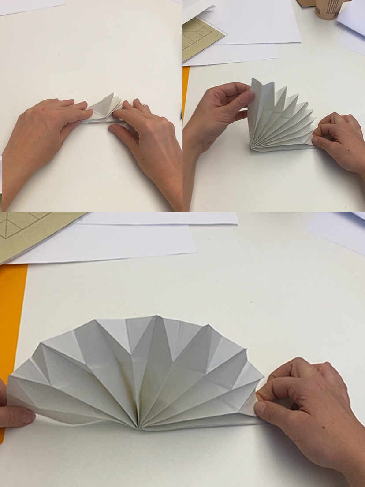
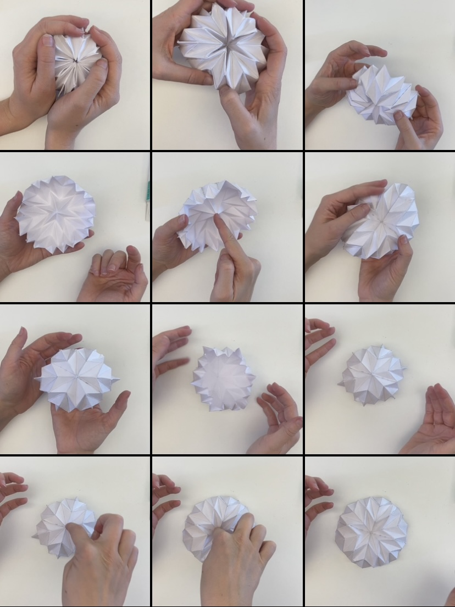

# First feedbacks / Notes to myself

- Cloisonner mes fenêtres. What happens when there's no windows anymore maybe other windows will appear ? 

- Sensory deprivation = Do some research on it.

- What windowless space can do. 

- Explore Orimetics and Oribotics.
 

# Studies 

# What is sensory deprivation ?

It's the deliberate reduction or removal of stimuli from one or more of the senses. 

Simple devices such as blindfolds or hoods and earmuffs can cut off sight and hearing, while more complex devices can also cut off the sense of smell, touch, taste, thermoception (heat-sense), and the ability to know which way is down.

# Windowless environnements 

While windows are sorely missed in static, restricted spaces, more active, dynamic situations are quite tolerable without windows.

> Insight : **Windowless space does not deprive a person of all sensory stimuli but it does reduce the amount of visual, auditory and thermal input he can receive from the outsider world.**

> input : - visual - auditory - thermal - light ? 

# Window and People 

Vehement assertions have been made about - man's basic need for
windows. 

Thus, Morgan (1967) claimed that "ordinary man might
therefore define the function of the window as the **medium through which he maintains contact** with his **environment**, with **life**, which enables him deep in his **subconscious to know that he is a free man".**

Evidently, the **window offers** the possibility of a **brief
respite** or **momentary escape** from somewhat undesirable surroundings.

Furthermore, **a window affords the continuous possibility of escape for each individual to use as he chooses.**

# View 

It is considered here to refer simply
to the scene beyond the window. As such, it can be good or bad, beautiful or ugly, dynamic or static, but **always different from the scene within the interior space.**

Manning (1967) stated: "the uniquely important characteristics of windows appear to be their provision of a view: people within buildings seem to **need some contact with the outside world."**

Jackson and Holmes (1973a, 1973b) expanded upon the importance of a view for an office worker. "He looks out also for **release, in the form of movement** **compared with his static situation inside.**

**Movement = Life.**

**Static = Death.**

"The greater the distance, the less satisfied the subject was and the more he desired to sit nearer a window."

"Variations in shape , color, brightness,
texture and sky quality were preferred, suggesting that the possibility of change in a scene was important."

"these studies actually evaluated the **appeal of a moving, changing scene**, almost all the researchers believed that movement is also an essential quality of a **"good" view."**

# Second Feedbacks

Quel est le dispositif narratif ? 
Sound while opening the soft robot - something that unfold. 
Narrative dans le geste = Un Movement whithout codifying it like Tachi symbolism of the movement but everyone do it differently. 

Typology gesture. Not codify or also very mechanic.
Regarder dans la nature ex : poisson clow qui rentre et sors de l'anémone - mechanisms. la manière dont il bouge. 

# Ideas 

 
 
 

# Third Feedbacks

More on to the positive side (sensory depraviation) 
window japense insight = a portal, an escape from the inside world (walls) for the mind. Bring us somewhere else.

- concentrate on movements, folds big scale and after see for differrents materials kind of paper.

- Prototype different folding and unfolding ways qualites of these different openning.

- Different paper quality, weight.

# Reference 

Atelier OI
Collection de Luminaires
«Oïphorique»

 

 

 # Prototyping 

     Different Qualities / Feelings of opening  
     Folding around different gesture and movement  

# Sensors for the robot :
     input : - movement recognition = hands 
             - auditory - thermal - light 