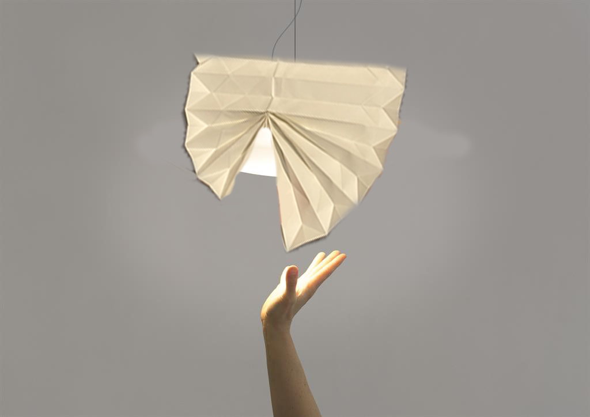

# Shapes and Ideas for my soft robot :

# Notes to myself 

**Keywords**

**Opening, 
Escape 
(to) Elsewhere,
Portal,
Unfolding
,Paper crumpling Sound**

Paper crumpling and smoothing = le froissement du papier. paper rustling = bruissement du papier.
The rustle of leaves in the wind. 
The flapping of a bird's wings.

- **WHAT - is it ? What does it do ?** 

**This soft robot mimic the function of the window as a portal that connects the inside and the outside world, offering an escape to elsewhere.**
(A breakaway to elsewhere.)

- **HOW - does the robot bring me elsewhere ?**

The robot brings you elsewhere by mimicking the portal aspect of a window world through subtle sensory triggers. When it opens, it produces gentle light changes and emits paper crumpling and rustling sounds. These sounds evoke familiar and comforting natural phenomena—the rustle of leaves in the wind, or the flapping of a bird’s wings. These elements spark your imagination, transporting you to an outdoor setting where you feel **connected to outside, even while indoors.**

WHERE - Where does it exist ?

On the wall. 

- WHO - interacts with the robot ?

The robot is interacted with by one person at a time, creating an intimate experience. However, it can be shared among multiple people living in the same apartment or house. Both adults and older children can engage with it.

- HOW - do these subjects interact ?

These subjects interact with the robot either by physically "opening" or unfolding it, allowing it to envelop them with gentle light changes and soothing paper crumpling and rustling sounds. 

Alternatively, they can interact using motion detectors, where placing their hands close to the robot activates its movement, causing it to open and come to life.

- WHY - for what reasons tis interaction taking place?

Interaction with the robot takes place to provide an escape, transporting you to another mental or emotional space. It invites you to slow down, meditate, and find calm amidst the busyness of daily life, offering "moments" of tranquility and reflection.

- Under what conditions this interaction takes place?

Initially, interaction occurs only when the individual consciously chooses to engage with the robot, seeking a moment of relaxation and escape. This choice reflects personal intention and control.

Alternatively, the robot could function as a living entity, regularly inviting moments of escape throughout the day. Like a window that's always present, it prompts diverse moments of connection, even when not actively sought. In this scenario, the interaction might be triggered by motion sensors, creating opportunities for spontaneous relaxation and detachment.

The first approach is about making a deliberate choice to use the robot, while the second is more like a window, always there and gently inviting you to take a moment to pause and relax.

- HOW - does it behave?

By triggering it or 
by itself.

- HOW - does it communicate?

**Threw sounds and movement.**

- WHY - Why does it exist?

The robot exists to offer moments of daydreaming and meditation, helping people escape the stresses and fatigue of everyday life. 

Is it a helpful or not helpful robot ?

Helpful

How does it influence me ?

Invites me to slow down. Focus on myself. 

Do we talk to each other ? Is there other way of comprehend ourselves ?
Threw gesture. 
The robot detect the movement with a camera he recognize when i'm close to him. He's able to reconize my hands.

How does he move ? 

He unfolds itself in a specific shape.

Or 

Unfolds itself by trying to follow my hands movements. 

It unfolds itlsef very slowly to inviten you to slow down. 

# Zimoun : installations sonores, sérialité et minimalisme digital.

His installations use analogue sounds. It is the series of elements that create the sound and not a single piece.

Even if he use everyday industrial-type materials, the sound that surrounds us in the space really get a feeling of some naturals sounds. Very relaxing.

[Zimoun : Compilation Video 4.3](https://youtu.be/xx4Kx6R7nv0?si=GxTtL2WvV9rWYR5i)

