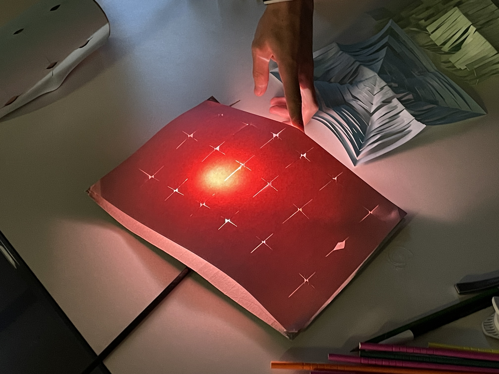
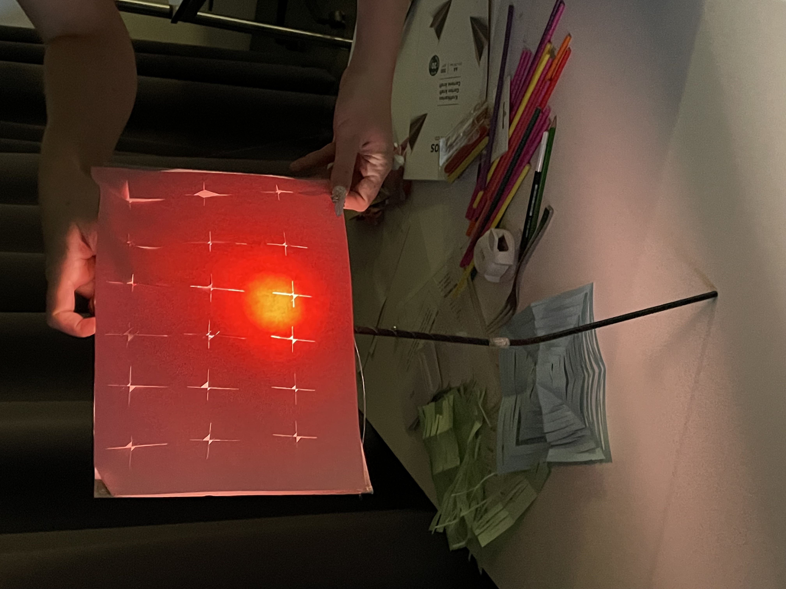
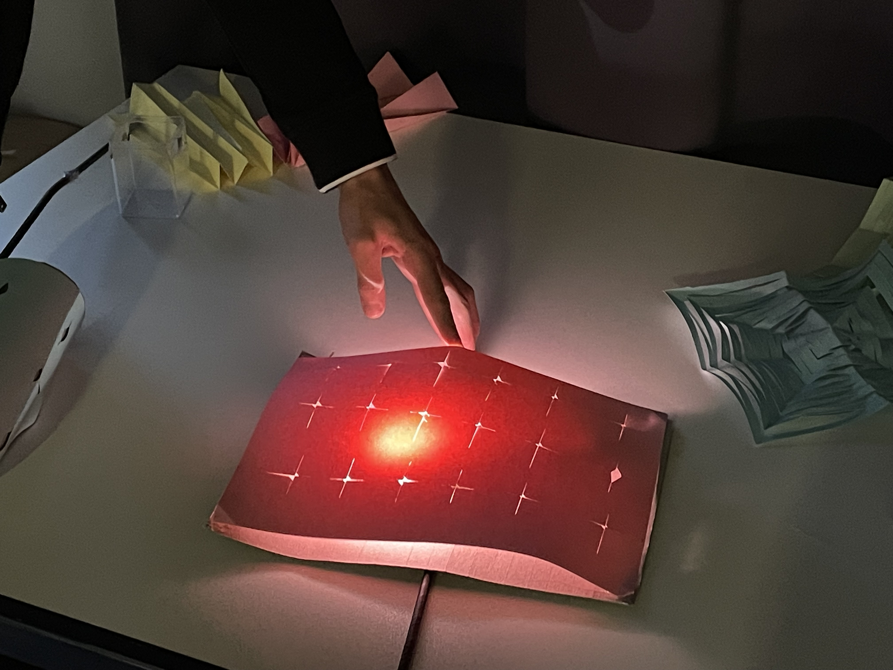
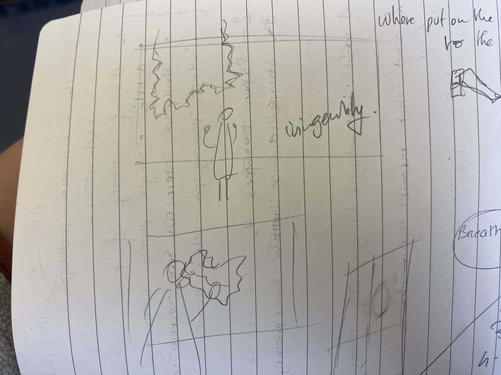
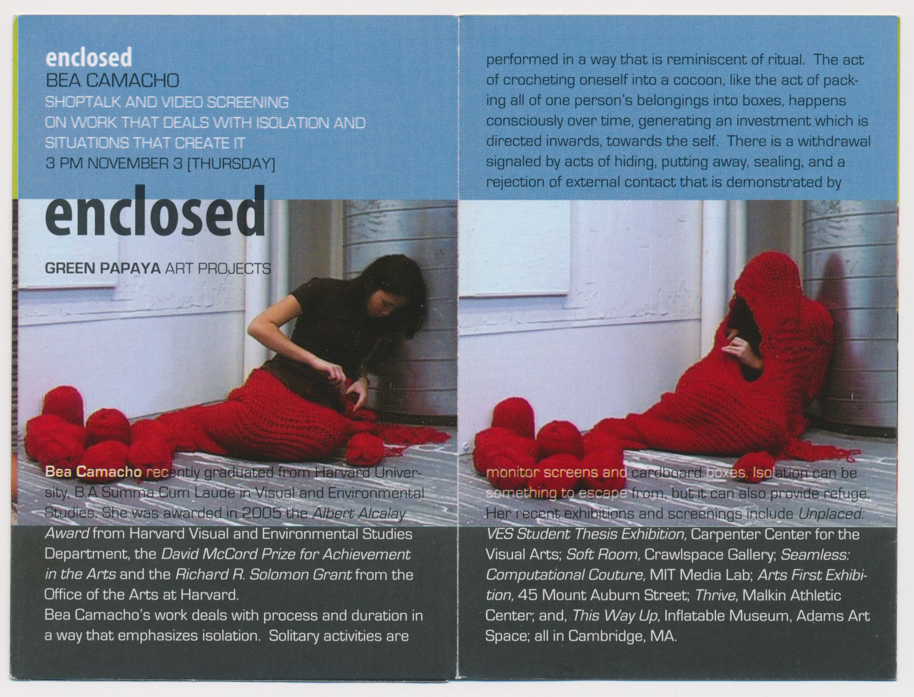
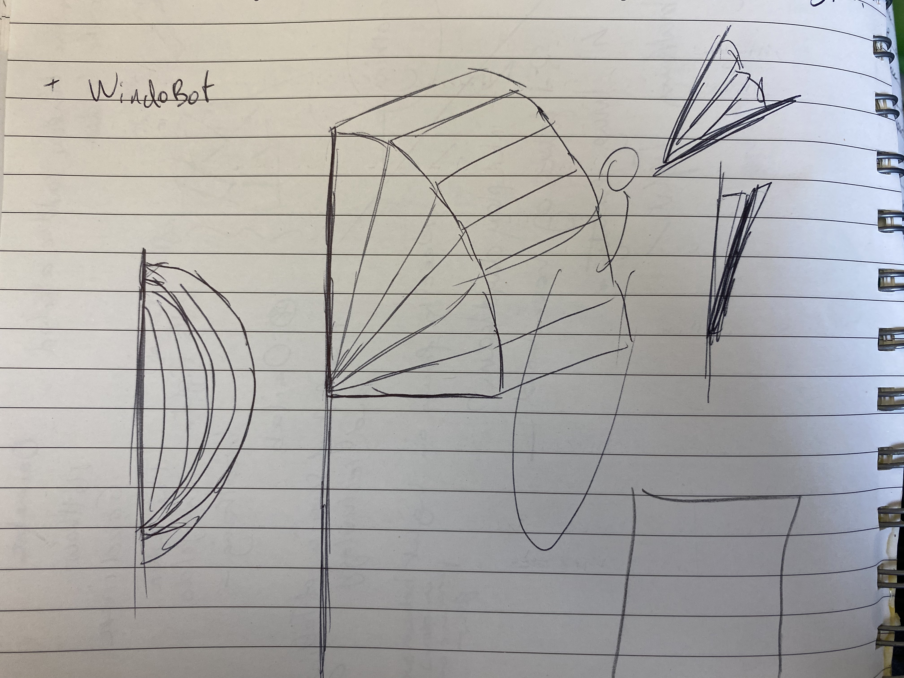
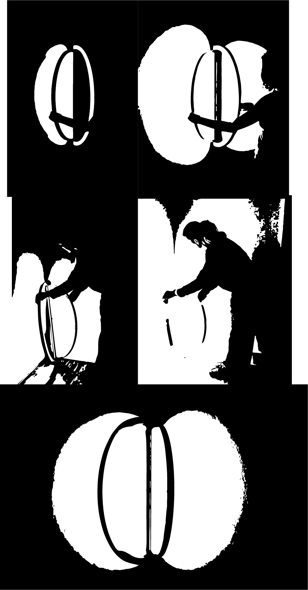

# Summary of my research and field research = 

# A - first week 

MY observations from my bedroom window reveal how human behavior and the surrounding environment deeply intertwine.

In essence, the window beyond being a mere architectural feature is a **powerful mediator**, a **portal** between my **inner world (walls)** and the **external landscape**. 
It subtly **orchestrates my routines/habits, impact my gestures & influence my states of mind.** 
Through it, **the weather**, **light**, and **seasons** become **intimate participants in my daily life**, guiding when I feel inclined to venture outside or cocoon within. These interactions with it reveal that human behavior is often less about conscious decisions and more about responses to the subtle **environmental cues** around us". 

The window doesn't just open to the outside; it creates an interplay between :
- **light, states, and habits.**
- **environnement cues**, **emotional response** and **Natural rythms**. 

> Definition : "Environmental cues" refer to visual and sensory signals in the environment, such as signage, color, and lighting

    **Keywords**
    Environmental cues
    Light
    Portal
    Inside-outside connection
    Interplay
    Mediator
    Natural rhytms
    State of mind
    Emotional response
    Room energy
    Weather

# B - Second Week

Japanese shoji windows offer a unique way of **connecting** the **home** with the **natural world**, quite different from European windows. By framing selected **views** of the outside, shoji windows **transform nature into a living artwork**, blending it with the home’s interior. These specific, framed views encourage **mindfulness** and **contemplation**, **inviting occupants to slow down** and appreciate nature’s subtleties, viewing their surroundings with intentionality and restraint. This deliberate **interaction with light and landscape** reflects a broader Japanese cultural attitude: one that values **balance**, simplicity, and a respectful coexistence between inside and outside worlds.

    Keywords:

    Shoji windows
    Framing nature
    Living environment
    Living artwork
    Mindfulness
    Contemplation
    Tranquility
    Simplicity
    Harmony
    Indoor-outdoor connection
    Appreciation of nature
    Meditative presence
    Privacy
    Connection 
    Stillness
    Reflection
    Balance
    Living environment

# Summary of both weeks : 

After an extensive research, the findings suggest that the **influence of windows** extends beyond traditional considerations such as physical health, safety requirements, and environmental standards often associated with **“healthy architecture.”** They also encompass elements related to **social, mental, and physical well-being.** The essence of windows surpasses their function as a mere transitional space, instead it functions as **a medium** for further exploration of our **connection to both our natural and artificial environments.**

# Little story behind my scenario

Last week my landlord offered to renew my lease for my room or change my bedroom as agreed with the one of my roommate which is larger. At first I thought I would take hers because I would have more room to do my art. But when I entered her room, although it was next to mine, I noticed that it was very dark, poorly lit due to the only small window on one of the walls. I imagine myself living in it and very quickly I chose to go back to my room because I couldn't imagine myself in such a poorly lit place. 

This made me think. I realised the importance of having a connection to the outdoors – even when you’re surrounded by four walls.

 Her lone window was the only source of connection to the outside world. How does she behave in her bedroom compare to mine ? If I was living in it I knew that it would have a severe impact on my routines, my states of mind, my well-being and overall my quality of life.

It makes sense, as extensive research has shown that our social, mental, and physical well-being can be effected by lack of access. This experience ignited my curiosity to delve into the several purpose of windows as an archetype. 

Can a soft robot mimic the several purpose of a window for an isolated room? 

# IDEAS 
# WindoBot Scenarios

WindoBot embodies my personal interpretation of the window as a tool that enables communication with our environment, and consequently, reflection with ourselves. It remains important for architectural design to place great emphasis on natural light and therefor windows. I believe viable solutions should be available for those living in spaces with limited to no qualitative window access, especially in situations where construction cannot be reversed or modified. The essence of windows surpasses their function as a mere transitional space, instead functioning as a medium for further exploration of our connection to our natural and artificial environments.

- Scenario 1

In this scenario WindoBot is  a soft robot mimicking the portal function of a window. It role is to transform an indoor space, providing not just light and visuals but also emotional support and a connection to the outside world.

Here WindoBot is an illuminated soft robots that draws inspiration from the natural rhythms observed through my window in Annemasse. WindoBot purpose it to give the sensation of having a living environnement especially for those suffering from poor quality windows. 
We can connect ourselves threw breathing techniques, leading like Shoji (japanese windowq) features to encourage **mindfulness** and **contemplation**, **inviting occupants to slow down**.

- Scenario 2

WindoBot a living entity that is adjustable by passing by. Can shrink or expands like a living entity

Reference: 

- Scenario 3 

In this scenario Windobot embodies my personal interpretation of the window as a tool that enables communication with our environment, and consequently, reflection with ourselves.

WindoBot is composed of adjustable components, each reflecting a crucial element of the window. Through their interactive nature, they endeavor to evoke the sensation of opening a window, allowing for an immersive experience. To achieve a realistic reflection of our precise external environment, the implementation of real-time weather data could be implamented ? 

The interactivity lends itself to the sensation of opening a window, while gaining differet light features creating an immersive experience. Which could be linked to my different habits, states, and emotionnal response.   

Open questions : 

**How can a soft robot mimic the function of a window to offer an immersive experience that deepens our connection to both natural and artificial environments within indoor spaces?**

**What new habits, states, routines could this soft robot replicate or create?**

**How can the sensory feedback from a soft robot be designed to mimic the calming and engaging effects of natural light or external views through a window ? - especially when that connection is limited or obstructed?**

**Can a soft robot be designed to facilitate a greater sense of openness and connection in spaces ?**
