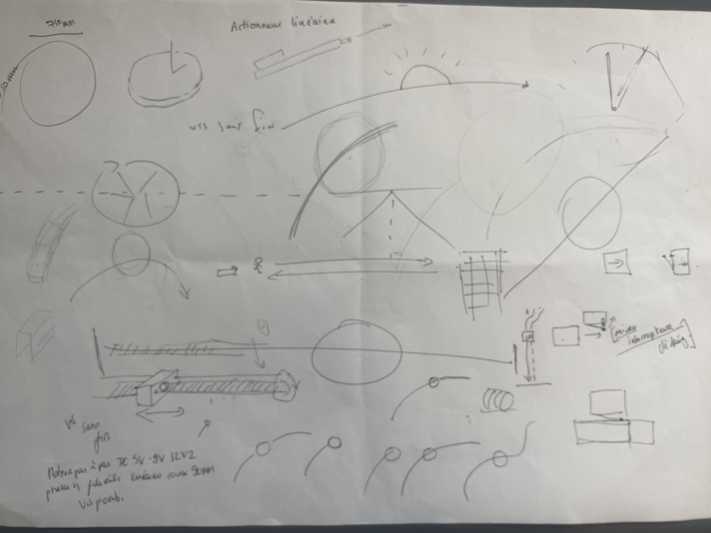

# Project development 

# An escape to elsewhere

# Research Question / area of research
The window 
- HOW - can i feel outside when i am inside ?
-  HOW - does the robot bring me elsewhere ? 
- How - could the soft robot help you visualize weather or brightness differently through movement & sound?

# Pitch
My soft robot mimic the function of the window as a portal, that connects the inside and the outside world, offering an escape to elsewhere throught movements and sounds. 

# Prototyping research

My research in soft robot prototyping explores the qualities of unfolding and opening through various folding techniques, emphasizing scale and how an opening can transport us to elsewhere, like a portal. I experiment with structures that start small and expand to become much larger, offering a possible escape. The folding movements are studied to enable different qualities of opening, while also integrating a sound dimension: the crumpling and rustling of paper evoke the rustle of leaves or the flapping of wings, connecting the interior to the exterior.

# Unfolding and folding ideas threw precise or unprecise movements.

  
 
 
 
 
 
 

 # Inspiration 
Old weather tools, time tool. 

 
  

  Dream machine

   
    

 # User Scenarios & Prototype
 # Your key prototype

The prototype is a wall-mounted soft robot that transports you elsewhere by mimicking the portal aspect of a window. It folds and unfolds, reacting to the brightness of the outside world, connecting the inside and outside. As it unfolds, it produces paper crumpling and rustling sounds, offering a soothing escape and moments of tranquility in everyday life.

# First key prototype

 

  
 
   

   # Second key prototype

 
   

   

  
  

# Next Steps
I will choose one of the two prototype. Resolve are the open mechanisms can work while thinking of the electronic part. I will also focused on the sound aspect of my soft robot.

# Form follow function 

# Feedbacks 

Sound work / explore it 
Echoing effect of paper (with wood box) Natural resonance like a speaker but different.
Much better than adding a speaker.
Hypnotic visual = you get lost just by looking at it.
Peut être utiliser un moteur qui réagit à la chaleur - moins de bruit qu'un servomoteur. 
Dynamic already in the shape référence : William Darrel. 

Think about the scale / Larger ones and keep some small ones to.
Inside Outside is the thing. You can get back to it later

Inspiration in old meteorological machines for the movement.

Water works well = change with pressure = Baromètre. 
Energy to motorized your robot = Play with the heat of the room. Sun.  mitro controlleur heat. Phycical ambiant room phillip ram (architect) = see is conference, spaces hot air going up and down in a room.

Quelque chose de presque siprituelle dans mon robot 
Entre le baromètre et le dieu du soleil.
Dream machine lampe - image fractale
Ajd lanternes magique qui te font rentrer dans des états de conscience. 
Réf = Roxyva. 

# Feedback générale

- External and interior sensibility 
Play with the input inner sensiorality ex: Thermical / état de conscience. 

- One more object in our daily lives - good balance between input output / ressources / solution / environnement / emotionnal impact.

- You can have many intercation with only one robot 
You can do more / better with less.

- Interacting with materials of are everyday lives 
Pre-existing "water, air, atmosphere" = maybe provides more intelligence to your object.

Why Soft robot are interesting ? 
Hard to control elephant trunk but gives many opportuynities.
Don't close the intercation = open it. 
Playing maybe with more aléatoire. 
Experiment with people. 
Maybe in the futur your soft robots learns = machine learning.

Observing different 

Drawing inspiration from le "Soleil Levant" 
The baguette turns and closes the flower while provinking sound. 

loose some dismensions top the project/ baguette won't close. 
Could the arc be the one that moves ? 

 

# Operating the mechanism

 
  
   
    
    
